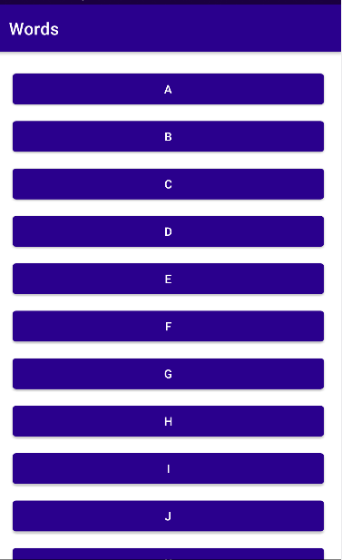
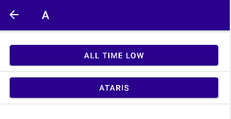

<h1 align="center"><b>Words </b></h1>
<h2>Sobre o Aplicativo</h2>
O aplicativo é como um dicionário de bandas de pop punk, você escolhe uma leta e irá listar duas bandas que tem as iniciais com essa letra.
Ao selecionar a banda de pop punk, o usuário será direcionado para o Google com a pesquisa da personagem selecionada.
<h2>Sobre o Projeto</h2>
O projeto foi desenvolvido a partir da sala de aula, com fins educacionais. 
  
Desenvolvido usando Kotlin no Android Studio.
<h2>Telas - Demonstração</h2>

  
  

<h2>Criador</h2>
Feito por <a href="https://github.com/peddrovieira">Peddro</a>
